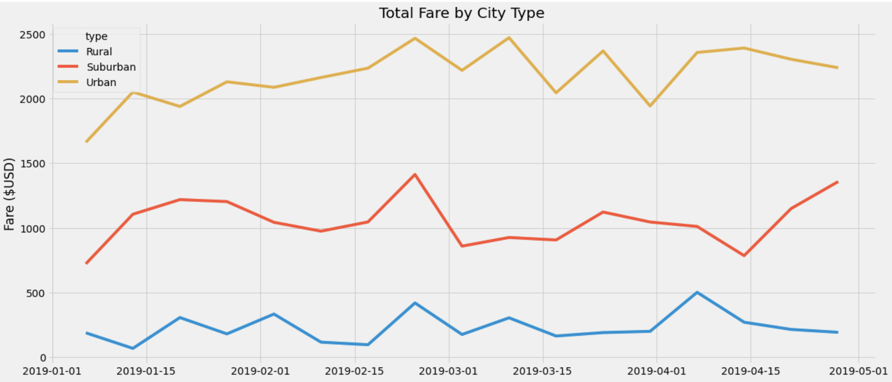

### PyBer_Analysis

### Overview

# In this challenge we are given the opportunity to provide a summary data frame for ride-sharing data by city type for the client. With this analysis we are helping to inference on overall amount of riders, average fares per rider and driver, drivers,  for each of the markets. The goal is to use the data over time to help the company see the three different ways they can adapt the supply to meet the demands of each market. 

### Results

# Results of the analysis show trends in each of the market segment of Pyber’s area. The population density increases, as well as total fare, drivers, and rides. Demand for ridesharing alternatives increases over the number of available customers in the area. 

- The visual of total market share of each segment had over a four month period. This shows each markets level of possible profit to make, along the ups and downs of revenue that could occur in within the time period. The line chart demonstrates a disparity with Total Fares from a DataFrame created earlier. Also, Urban areas, are in a range from $2000 to $2500. Rural is much less than, up to $500. Suburban areas seem to be the most stable out of the city types, in terms of market share.

### Summary

# Some recommendation to make that with the analysis help supports:

- Increase Supply in Rural area:
A ratio of 1.6 of ride to driver can show that there could be more drivers that can go to rural area to help with drives. Fare per ride metric is high in rural, that can help with bringing in more revenue.

-  Decrease Supply in Urban Area:
There is not as much of drives needed in the urban area, so too many drivers are in need of rides to make profit. The company could cut cost of employing drivers if they would have less drivers in the urban area. 

